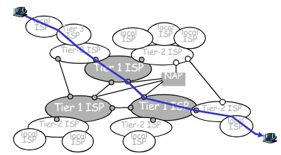
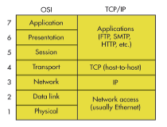
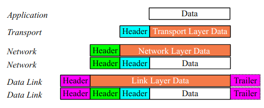
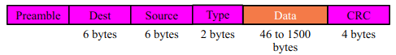
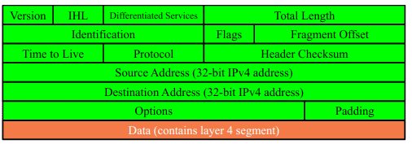
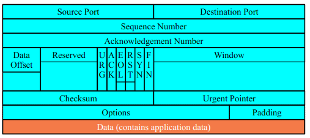

[Day 1](http://learn.lboro.ac.uk/pluginfile.php/976792/mod_resource/content/1/coc_2017_day1.pdf)

# IP and Networking Basics
*Day 1 - Page 2*

**Parallel**: multiple bits are transferred at once.
**Serial**: bits are transferred one after another.

**Circuit Switching**: The actual network is mutated to provide two end points direct connection to one another. Then data can be transferred directly from one end to the other.
**Packet Switching**: The entire network is connected simultaneously. Data is split into packets. Packets are then routed through the network based upon their own destination addresses. When received packets are reassembled in the proper order to create the original message.

> History of the internet: page 8-10

The internet is arranged into a network of networks with a rough hierarchy
- at center "Tier 1" ISPs
  - national coverage
  - e.g. Level 3, Cogent, NTT
- Tier 2 ISPS
  - usally smaller
  - regional
  - connect to one of more tier-1
  - possibly connet to other tier-2 ISPs
- Tier 3
  - last hop (closest to end systems)




- IP has no "connection"
  - packets do not garuntee order
  - each packet finds its own way
  - no error detection
  - no congestion control (beyond "drop")
- TCP helps for connection-oriented applications
  - error correction by retransmission

# OSI Stack & TCP/IP Architecture
*Day 1- Page 16*

Edge vs Core (end-systems vs routers)
- Core
  - contains routers and dumb systems
  - connectionless
- Edge
  - **connection oriented**
    - Achieved by **TCP**
  - contains hosts, computers, servers
  - run application programs
  - peer to peer

## Connection Orientated - TCP
- handshake
- setup state
- flow control
  - slow down sending rate if receiver becomes overwhelmed
- congestion control
  - slow down sending when the network is congested

## Connectionless service - UDP
- Unreliable
- no flow control
- no congestion control

## Layers


Important layers to know are:
- Layer 7: Applicaition - Netscape navigator
- Layer 4: Transport (**segment**) - TCP, UDP
- Layer 3: Network (**datagram**)- Ip Addresses
- Layer 2: Data Link (**frame**) - Ethernet - Mac Addresses
- Layer 1: Physical - Binary

Each layer is unaware of the mechanics of the other layers.

The application layer communicates with other application layers, seemingly, directly. It simply passes the data to the next layer down and it arrives intact and complete at the destinations layer 7. No need to know what the other layers do.



## Layer 2 - Ethernet frame

- Destination and source are 48-bit Mac addesses
- Type of `0x0800` means the data portion contains an IPv4 datagram
- Type of `0x0806` is ARP
- Type of `0x86DD` is IPv6
- The data part contains a layer 3 datagram

## Layer 3 - IPv4 datagram

- Version = 4
- If no options specified:
  - IHL = 5
  - Source and Destination addresses are 32bit IPv4 addresses
- Protocol of `6` means the data contains TCP
- Protocol of `17` means the data contains UDP

## Layer 4 - TCP segment


- Source and Destination are 16-bit TCP port numbers (ip address implied by the IP header)
- if no options:
  - Data Offset = 5 (meaning 20 octets)

# IP Addressing
*Day 1- Page 29*
- Unique ID from source and destination
  - sometimes used for security or policy-based filtering
- Moving a machine between networks involves changing IP address
- Assigned in a heirarchical fashion
  1. IANA (Intenet assigned number authority)
  2. IANA to RIRs (AfriNIC, ARIN, RIPE, APNIC, LACNIC)
  3. ISPS and Large organizations
  4. End users

IP addresses are divided into *network* and *host* parts
2 computers on the same network will have the same network parts but different host parts.
The boundry between the network and host parts can be anywhere along the 32 bits.

**Network masks** help differentiate between host and network parts by containing all 1s in the network part and 0s in the host part

```javascript
             NETWORK                  | HOST
1111 1111   1111 1111   1111 1111   11|00 0000  netmask
1100 1101   0010 0101   1100 0001   10|00 0000  ip address
```

The slash notation shows where the divide is:

```javascript
112.0.0.34/24  => 24 bits of network and 8 of host
```

## Special Addresses
If the host part contains all **0s** then it represents the **network** address
All **1s** in the host part is the **broadcast** address

**127.0.0.0/8** is a loopback address (127.0.0.1)
**0.0.0.0** has various special purposes

---------------------------

http://learn.lboro.ac.uk/pluginfile.php/976842/mod_resource/content/0/coc190_2017_day2.pdf

# Concept Review
*Day 2 - Page 2*

# More IPv4
*Day 2 - Page 8*
<pre>
Maximum Number of hosts = number of bits in host part - 2
Very large blocks allocated to RIRs (e.g /8)
  - Divided into smaller blocks for business (e.g /17)
  - Divided into smaller blocks for local networks (e.g /26)
  - Each host geta a host address
Current system - classless, slash/netmask notation
Old System - Classes (A, B, C)
Class A - large, 8 bit network, 24 bit host
Class B - medium, 16 bits network, 16 bit host
Class C - small, 24 bit network, 8 bit host
CIDR - Classless Inter-Domain Routing (routing does not assume that class implies prefix length)
VLSM - Variable-Length Subnet Masks (routing does not assume all subnets are the same size)
Classless example:
  ISP get large bloack of addresses e.g. /16 (65536 addresses)
  Allocates smaller blocks to customers e.g. /22 (1024), /28 (16) etc
  An organisation recieving /22 divideds it into smaller blocks e.g. /26 (64), /27 (32) etc
Private addresses - not allocated to any particular organisation, internal use, not globally unique -> not internet routable
IPv4 addresse space running out - work arounds (NAT, dynamic allocation of less addresses than customers etc), IPv6 is real solution. Causes: WWW unforseen, created massive deman, networking of previously standalone devices, ineffcient allocation of initial address space
NAT (Network Address Translation) - Internal addresses are private, router translates private IP's to public ones, violates layer seperation
Dynamic Allocation - More customers than address, addresses allocated on demand, assumes not everyone online at the same time, most customers dont get static IP address
ARP (Address Resolution Protocol) - In local network, LAyer 7 apps need to connect to distributed Apps by IP address, LAN commuinication lower doesn needs also a MAC address to encapsulate and form an ethernet frame to go to wire, ARP maps these two and caches mapping to ARP table
DHCP (Dynamic Host Configuration Protocol) - Dynamic allocation of host addresses
  Host braodcasts UDP Datagram using port 67 with "this host" source address; 0.0.0.0
  DHCP server sends "offer"
  Host sends "Request"
  DHCP sever sends Ack
DNS (Domain Name System) - Maps human readable name to IP address
</pre>

# IPv6
*Day 2 - Page 18*

<pre>
Successor to IPv4
Expanded address space - Address length quadrupled to 16 bytes (128 bits)
Header format simplification - fixed length, optional headers are dasiy-chained
No checksum at the IP network layer

Add image of IPv4/IPv6 header comparison

IPv4 - 32 bits, 4,294,967,296 possible addresses
PIv6 - 128 bits, 3.4 x 10^38 addresses, 5 x 10^28 per person on the planet

Address Representation - 16 bit fields in case insensitive colon hexadecimal representation
Leading zeros in a field are optional
Succerssive feilds of 0 given by ::, but only once in an address
  - 0:0:0:0:0:0:0:1 -> ::1 (loopback address)
  - 0:0:0:0:0:0:0:0 -> :: (unspecified address)
In a URL it is enclosed in square brackets e.g. http://[2001:4860:b006::67]:80/index.html, cumbersome for users, mostly for diagnostic purposes, use FQDN (Fully Qualified Domain Name) instead

Global Unicast Addresses: Provider - Site - Host = 48 bits - 16 bits - 64 bits = 001 - Global Routing Prefix - Subnet-id - Interface ID

Address Allocation:
  IANA is allocating out of 2000::/3 for initial IPv6 unicast use
  Each registry gets a /12 prefix from the IANA
  Registry allocated a /32 prefix (or larger) to an IPv6 ISP
  Policy is that an ISP allocates a /48 prefix to each end customer
Registry - /12, ISP prefix - /32, Site prefix - /48, LAN prefix - /64

64 bits reserved for the interface ID - possibility of 2^64 hosts on one network LAN
16 bits reserved for the end site - possibility of 2^16 networks at each end-site, 65536 subnets equivalent to a /12 in IPv4 (assuming 16 hosts per IPv4 subnet)

Benefits:
  Every link uses fe80::/64 for link-local stuff (hosts in isoloated networks automatically communicate)
  Router can announce global addresses, Router Advertisement (RA) ICMP packets e.g 2001:608:4:0::/64
  Clients will use all available /64 prefixes (compute the host part from their MAC address, EUI-64: Algorithm for computing 64-bit host paart from 48-bit (Ethernet) MAC address)
  
EUI-64 diagram but probably not needed
  
Migration towards IPv6:
  Problems:
    v4 host wanting to talk to v6 host
    v6 networks that are only connected by v4 infrastructure
  Migration techniques::
    Duel-stacked hosts/router (v4 + v6 IP stack on same machine)
    Duel-stacked proxies / application-level gateways
    Tunnelling
      Manually configured tunnels
      Automatic tunnelling (6to4, ISATAP, Teredo)
      Tunnels configured by tunnel broker

Duel Stack Image
</pre>

# Large Network Issues & Routers
*Day 2 - Page 25*

<pre>
Need for Packet Forwarding:
  Many small networks can be interconnected to make a larger internetwork
  A device on one network cannont send a packet directly to a device on another network
  The packet has to be forwarded from one network to another, through intermediate nodes, until it reaches its destination
  Intermediate nodes -> routers

IP Router:
  A device with more than one link-layer interface
  Different IP addresses (from different subnets) on different interfaces
  Recieves packets -> forwards them to get them one hop closer to destination
  Maintians forwarding tables

Action for each packet:
  Packet recieved on one interface
  Check if router is destination -> if so, pass to higher layers
  Decrement TTL (time to live) -> discard if TTL = 0
  Look up destination IP in forwarding table
  
Forwarding vs Routing:
  Forwarding -> moving packets from input to output (uses forwarding table and info in packet)
  Routing -> process which builds and maintains the forwarding table (one or more routing protocols, Procedures (algorithms) to convert routing info to forwarding table)
  Basic: 
    Routing = building maps + giving directions
    Forwarding = moving packets between interfaces based on directions

Each router tries to get the poacket one hop closer to destination
Each router makes an independent decision based on its own forwarding table
Routers talk routing protocols to each other, to help update routing and forwarding tables

Router Functions:
  Determin optimum routing path through network (lowest delay, highest reliability)
  Move packets through the network
  Interconnected router exchange routing tables in order to maintain a clear picture of the network
  In a large network -> routing table updates can consume a lot of bandwidth (update protocol required)

Forwarding Table Structure:
  Don't list every IP number on the Internet (would be huge)
  Contains prefixes (network numbers) -> "If the first /n bits matches this entry, send the datagram that way"
  Longest prefix wins (more specific route) if more than one
  0.0.0.0/0 is default route -> matches anything but only if no other prefix matches
  
</pre>

# Cisco Router Configuration - Basics
*Day 2 - Page 30*

Is this really needed?
------------------------

http://learn.lboro.ac.uk/pluginfile.php/979934/mod_resource/content/1/17coc190_Day3.pdf

# Concept Review
page 2

# Static and Dynamic Routing
page 6
# Layer-2 Network Design
page 11
# Link Aggregation
page 27

# Switching Loops
page 29

------------------------

http://learn.lboro.ac.uk/pluginfile.php/981753/mod_resource/content/0/coc190_2017_Day4.pdf

# Concept Review
page 2

# Address Resolution Protocol (ARP)
page 10

# Routing
page 14

http://learn.lboro.ac.uk/pluginfile.php/981754/mod_resource/content/0/coc190_2017_day4a.pdf

# Dynamic Routing
page 1

------------------------

http://learn.lboro.ac.uk/pluginfile.php/985655/mod_resource/content/0/coc190_2017_Day5.pdf


# Concept Review
# Address Resolution Protocol (ARP)
page 2


http://learn.lboro.ac.uk/pluginfile.php/985654/mod_resource/content/0/coc190_2017_day5a.pdf


# Distance Vector Worked Example
page 1

# IS-IS
page 10

------------------------

http://learn.lboro.ac.uk/pluginfile.php/990708/mod_resource/content/0/coc190_2017_day6.pdf

# Concept Review
page 2
- Link state protocols
- Dijsktra's Algorithm
- OSPF
- IS-IS

# Autonomous Systems
page 13

# BGP
page 14

# BGP Part 2
page 24

------------------------

http://learn.lboro.ac.uk/pluginfile.php/994793/mod_resource/content/0/coc190_2017_day7.pdf


BGP Protocol Basics
Small ISP with one upstream provider
Keeping Local Traffic Local
A Large ISP with more than one upstream provider
Terminology: “Policy”

------------------------

http://learn.lboro.ac.uk/pluginfile.php/996302/mod_resource/content/0/coc190_2017_day8.pdf

# DNS
page 10

# NAT
page 32

------------------------
